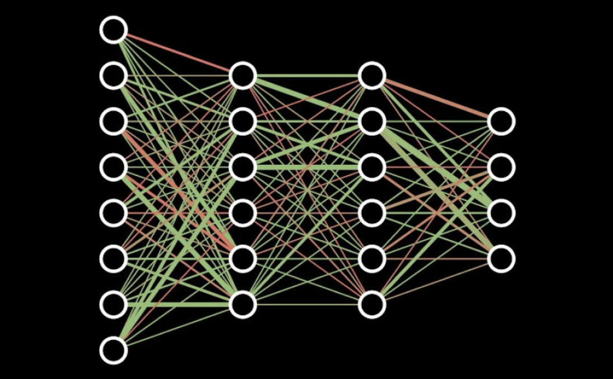
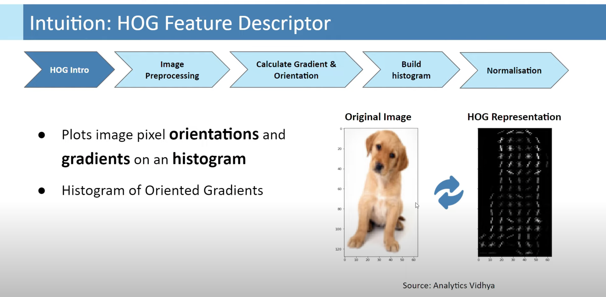

# Readme

# Exploring Digit Classification Programs:

Digit classification plays a crucial role in various applications, from optical character recognition to automated document processing. In this repository, I will outline three different programs that implement digit classification using different techniques and libraries. This aim of this README is to provide a overview of the technical highlights of each program.

## Program 1: NN-Digit-Classifier-Numpy-Only(V1)

### Main Technical Features:

- Implements a neural network for digit classification using only the NumPy library.
- Defines a **`NeuralNetwork`** class with methods for forward and backward propagation.
- Utilises activation functions like ReLU and softmax.
- Implements gradient descent for parameter updates.
- Includes utility methods for data preprocessing, evaluation, and accuracy computation.

## Program 2:  Histogram-Oriented-Gradients-NN-Implementation (V2)

### Main Technical Features:

- Utilises the scikit-image library's HOG feature extraction for digit representation.
- Performs feature scaling using **`preprocessing.MaxAbsScaler`**.
- Splits the data into training and testing sets using **`train_test_split`** from scikit-learn.
- Implements a neural network with ReLU activation and softmax for multi-class classification.
- Uses gradient descent for parameter updates and evaluates accuracy during training.

## Program 3: NN-Numpy-Only-HOG-Feature-Extraction-and-ML-Library-Integration

### Main Technical Features:

- Applies feature scaling using StandardScaler from scikit-learn.
- Compiles the model with the Adam optimiser and sparse categorical cross-entropy loss.
- Trains the model using the training data for a specified number of epochs and batch size. 
- Implements a neural network using the Keras library.
- Compiles the model with the Adam optimiser and sparse categorical cross-entropy loss.

**Exploring Minimum Redundancy Maximum Relevance (mRMR) feature selection:** 
- mRMR is an algorithm that selects informative features in classification tasks.
- It chooses features that are highly relevant to the target variable and have low redundancy with each other.
- By maximising relevance and minimising redundancy it is able to form a subset of key features.
- Using this method means that it would potentially select more relevant and non-redundant features from a high-dimensional input.
- This would further enhance the efficiency, performance, and how the NN interprets the data.
